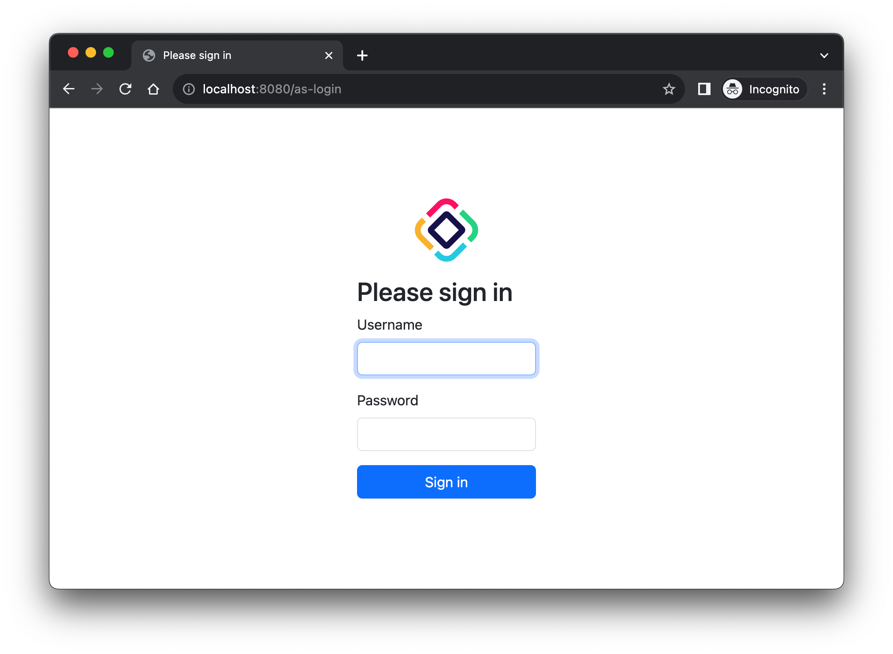
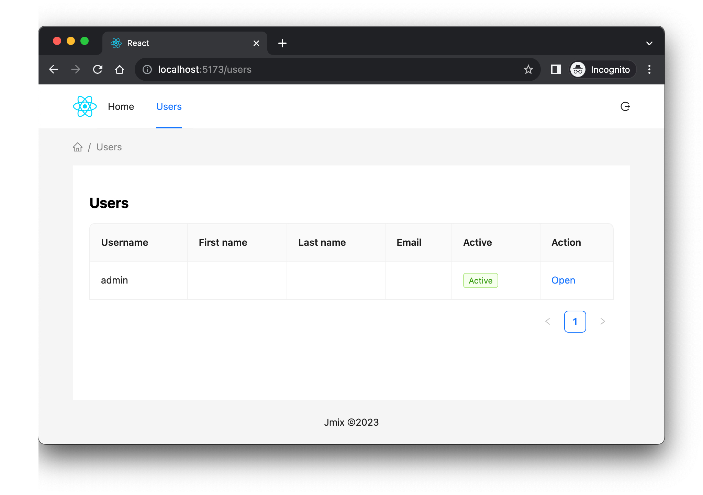

# React Frontend Sample

This example demonstrates a custom React frontend application working with Jmix backend through the [Generic REST](https://docs.jmix.io/jmix/rest/index.html). The frontend application uses the [OAuth2 Authorization Code](https://docs.jmix.io/jmix/rest/access-control.html#authorization-code-grant) flow for user authentication.  

## Jmix Backend Application

This is a simple Jmix application with the Generic REST and Authorization Server add-ons.

The Authorization Server is configured in [application.properties](jmix-backend/src/main/resources/application.properties) to use the Authorization Code grant as described in the documentation.

The backend application provides a custom login form for frontend authentication: [custom-as-login.html](jmix-backend/src/main/resources/templates/custom-as-login.html).

To start the backend application, open the terminal in `react-frontend-sample/jmix-backend` folder and execute: 

```
./gradlew bootRun   
```

The application UI will be available at http://localhost:8080. You can log in to the application with `admin / admin` credentials.

## React Frontend Application

An example of a React application with the [Ant Design](https://ant.design/) UI library. The [react-oauth2-code-pkce](
https://github.com/soofstad/react-oauth2-pkce) library is used to provide OAuth2 Authorization Code flow.

The OAuth2 settings are defined in [main.tsx](react-frontend/src/main.tsx), see the `authConfig` variable.

To start the frontend application in development mode, open the terminal in `react-frontend-sample/react-frontend` and execute the following commands: 
```
npm i
npm run dev
```

The frontend UI will be available at http://localhost:5173 (open this URL in a separate browser or in the incognito mode).

The frontend application will redirect to the login page provided by the Authorization Server of the backend app:



Enter `admin / admin` credentials and submit the form. You will be redirected to the frontend UI where you can see the list of users obtained from the backend: 



